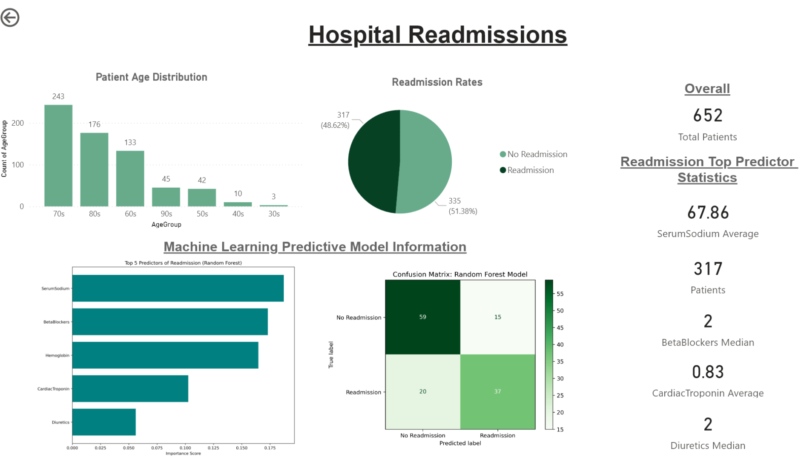

# Hospital Readmissions Analysis, Predictor, and Visualization 🏥 

Utilizing python, sql, and powerBI I created a random forest predictor of hospital readmissions that held 73% accuracy, Identified key variables in the prediction of readmissions, and present insights on a powerBI dashboard.

### Tech & Methods ⚙️

    
* Python/JuypterNotebook
* SQL/DB SQLite
* PowerBI

---
### Repository Information 📄
This repository includes 6 files: 
* README.md is what you are reading now and explains information associated with the project.
* HospitalReadmissionPrediction.ipynb includes the code associate with creator of 73% accurate readmission calculator and python analyis.
* ReadmissionQuery.sql contains the sql querys ran to determine key insights.
* Dashboard_Readmission.pbix is the powerBI dashboard that displays key insights.
* Dashboard_Readmission.pdf is the pdf version of the dashboard that displays key insights.
* Dashboard_HR.png is a image of the dashboard used in the markdown README.md

---
### Data 🗃️ 
Hospital readmission data from Kaggle, including 57 measures of health for 8481 observations/events. 

[Link to Data](https://www.kaggle.com/datasets/ahmedwadood/hospital-readmission/code)

